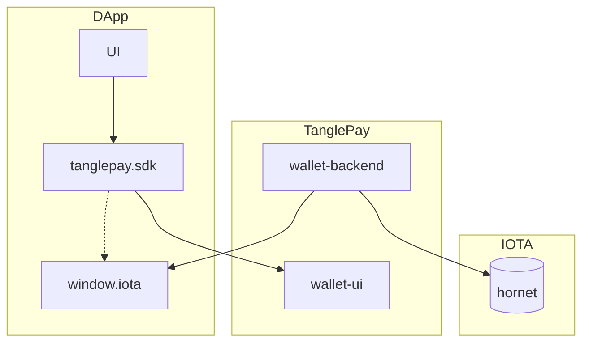

# TanglePay - Javascript/Typescript SDK
DApp SDK to interact with TanglePay wallets.

You may find the following instructions familiar if you are already an experience DApp developer with Etherum, TanglePay.

## Architecture



## Supported Platforms
- [X] Browser extensions
- [ ] Mobile

## Supported Networks
- [X] IOTA
- [ ] Shimmer
- [ ] Assembly
- [ ] EVM

## Getting started
NPM package

`npm install tanglepay-sdk --save`

For any non-trivial IOTA web application — a.k.a. dapp, web3 site etc. — to work, you will have to:

- Detect the IOTA provider (window.iota)
```javascript
if (typeof window.iota !== 'undefined') {
  console.log('TanglePay is installed!');
}
```
- Detect which IOTA network the user is connected to, which could be IOTA, Shimmer, Assembly
- Get the user's IOTA account(s)

## API Reference
### Properties
#### *iota.isTanglePay*

`true` if the user has TanglePay installed.

#### *iota.tanglePayVersion*

`version` if the user has TanglePay installed.

### Methods
#### *iota.request(args)*
Use `request` to submit RPC requests to IOTA via TanglePay. 

It returns a `Promise` that resolves to the result of the wallet method call.

The `params` and return value will vary by method. 

In practice, if a method has any `params`, they are almost always of type `Array<any>`.

If the request fails for any reason, the Promise will reject with an `ProviderError`.

Check the TanglePay Wallet API documentation for details.

##### Example

```javascript
params: [
  {
    subject: 'foo.com',    
    value: 'message to sign', // 2441406250
    data:
      'message to sign',
  },
];

iota
  .request({
    method: 'iota_sign',
    params,
  })
  .then((result) => {
    // The result varies by method.
    // For example, this method will return a message id on success.
  })
  .catch((error) => {
    // If the request fails, the Promise will reject with an error.
  });
```

### Events
#### *accountsChanged*
```javascript
iota.on('accountsChanged', handler: (accounts: Array<string>) => void);
```

### Error
```javascript
interface ProviderError extends Error {
  message: string;
  code: number;
  data?: unknown;
}
```
### Wallet API
#### iota_accounts
##### Returns
string[] - An array of a logged in IOTA address string.

##### Description
Requests that the user provides an IOTA address to be identified by. 

Returns a Promise that resolves to the hash of signed messaage. 

If the user denies the request, the Promise will reject with an error.

The request causes a TanglePay popup to appear. 

You should only request the user's accounts in response to user action, such as a button click. You should always disable the button that caused the request to be dispatched, while the request is still pending.

#### iota_getBalance
##### Returns
Returns the balance of the account of given address.

Example
```javascript
{
  amount: "", // in # of IOTA
  collectibles: [
    {
        'source': 'soonaverse',
        'id': '',
        'media': '',
    }
  ],
  others: [
    {
        'symbol': 'asmb'
        'icon': '<uri of icon>',
        'amount': 312.312
    }
  ]
}
```

##### Parameters
```javascript
params: [
    '<iota address>'
]
```

#### iota_sign
##### Returns
Signed hash data.

##### Parameters
```javascript
params: [
    '<iota address>',
    '<data to sign>',
]
```
Wallet will use the private key to sign the payload directly and will not post the message to IOTA network.

##### Description
Requests that the user to sign the given message. Returns a Promise that resolves to an array of a single IOTA address string. If the user denies the request, the Promise will reject with an error.

The request causes a TanglePay popup to appear. You should only request the user's accounts in response to user action, such as a button click. You should always disable the button that caused the request to be dispatched, while the request is still pending.

If you can't retrieve the user's account(s), you should encourage the user to initiate an account request.

## Best-Practice
### Create a sample DApp on IOTA

**TODO: move this to demo site of this repository.**
```javascript
const initialize = () => {
  //Basic Actions Section
  const onboardButton = document.getElementById('connectButton');
  const getAccountsButton = document.getElementById('getAccounts');
  const getAccountsResult = document.getElementById('getAccountsResult');

  //Created check function to see if the TanglePay extension is installed
  const isTanglePayInstalled = () => {
    //Have to check the iota binding on the window object to see if it's installed
    const { iota } = window;
    return Boolean(iota && iota.isTanglePay);
  };

  //We create a new TanglePay onboarding object to use in our app
  const onboarding = new TanglePayOnboarding({});

  //This will start the onboarding proccess
  const onClickInstall = () => {
    onboardButton.innerText = 'Onboarding in progress';
    onboardButton.disabled = true;
    //On this object we have startOnboarding which will start the onboarding process for our end user
    onboarding.startOnboarding();
  };

  const onClickConnect = async () => {
    try {
      // Will open the TanglePay UI
      // You should disable this button while the request is pending!
      await iota.request({ method: 'iota_accounts' });
    } catch (error) {
      console.error(error);
    }
  };

  const TanglePayClientCheck = () => {
    //Now we check to see if TanglePay is installed
    if (!isTanglePayInstalled()) {
      //If it isn't installed we ask the user to click to install it
      onboardButton.innerText = 'Click here to install TanglePay!';
      //When the button is clicked we call th is function
      onboardButton.onclick = onClickInstall;
      //The button is now disabled
      onboardButton.disabled = false;
    } else {
      //If TanglePay is installed we ask the user to connect to their wallet
      onboardButton.innerText = 'Connect';
      //When the button is clicked we call this function to connect the users TanglePay Wallet
      onboardButton.onclick = onClickConnect;
      //The button is now disabled
      onboardButton.disabled = false;
    }
  };

  //Iota_Accounts-getAccountsButton
  getAccountsButton.addEventListener('click', async () => {
    //we use iota_accounts because it returns a list of addresses owned by us.
    const accounts = await iota.request({ method: 'iota_accounts' });
    //We take the first address in the array of addresses and display it
    getAccountsResult.innerHTML = accounts[0] || 'Not able to get accounts';
  });

  TanglePayClientCheck();
};

window.addEventListener('DOMContentLoaded', initialize);
```
