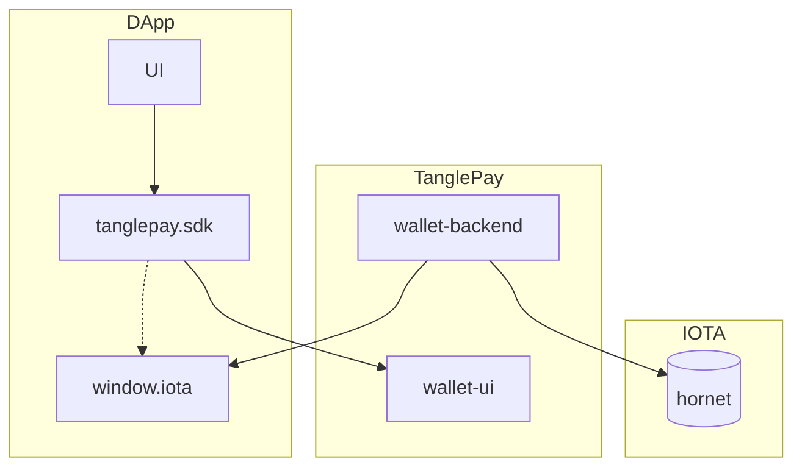

# TanglePay - Javascript/Typescript SDK
This repostiory contains Javascript/Typescript SDK for DApps in `IOTA` ecosystem to interact with TanglePay wallets.

You may find the following instructions familiar if you are already an experience DApp developer with Etherum, Metamask.
For more details, please refer to the specification below or the [Demo](https://tanglepay.github.io/TanglePay-SDK/).

## Architecture



## Supported Platforms
- [X] Browser extensions
- [ ] Mobile

## Supported Networks
- [X] IOTA
- [ ] Shimmer
- [ ] Assembly
- [ ] EVM

## Getting started
NPM package

`npm install tanglepay-sdk --save`

For any non-trivial IOTA web application — a.k.a. dapp, web3 site etc. — to work, you will have to:

- Detect the IOTA provider (window.iota)
```javascript
if (typeof window.iota !== 'undefined') {
  console.log('TanglePay is installed!');
}
```
- Detect which IOTA network the user is connected to, which could be IOTA, Shimmer, Assembly
- Get the user's IOTA account(s)

## API Reference
### Properties
#### *iota.isTanglePay*

`true` if the user has TanglePay installed.

#### *iota.tanglePayVersion*

`version` if the user has TanglePay installed.

### Methods
#### *iota.request(args)*
Use `request` to submit RPC requests to IOTA via TanglePay. 

It returns a `Promise` that resolves to the result of the wallet method call.

The `params` and return value will vary by method. 

In practice, if a method has any `params`, they are almost always of type `Array<any>`.

If the request fails for any reason, the Promise will reject with an `ProviderError`.

The `keepPopup` argument is only used in brower context to help DApp determine the management of extension experience.

Check the TanglePay Wallet API documentation for details.

##### Example

```javascript
params: [
  {
    subject: 'foo.com',    
    value: 'message to sign', // 2441406250
    data:
      'message to sign',
  },
];

iota
  .request({
    method: 'iota_sign',
    keepPopup: true
    params,
  })
  .then((result) => {
    // The result varies by method.
    // For example, this method will return a message id on success.
  })
  .catch((error) => {
    // If the request fails, the Promise will reject with an error.
  });
```

### Events
#### *accountsChanged*
```javascript
iota.on('accountsChanged', handler: (accounts: Array<string>) => void);
```

### Error
```javascript
interface ProviderError extends Error {
  message: string;
  code: number;
  data?: unknown;
}
```
### Wallet APIs
#### *iota_connect*
##### Returns
The IOTA address of current connected wallet.

##### Parameters
```javascript
params: [
]
```
The users will be redirected to the TanglePay and confirm connecting DApp with the current signed in wallet.


#### *iota_accounts*
##### Returns
string[] - An array of a logged in IOTA address string.

##### Description
Requests that the user provides an IOTA address to be identified by. 

Returns a Promise that resolves to the hash of signed messaage. 

If the user denies the request, the Promise will reject with an error.

The request causes a TanglePay popup to appear. 

You should only request the user's accounts in response to user action, such as a button click. You should always disable the button that caused the request to be dispatched, while the request is still pending.

#### *iota_getBalance*
##### Returns
Returns the balance of the account of given address.

Example
```javascript
{
  amount: "", // in # of IOTA
  collectibles: [
    {
        'source': 'soonaverse',
        'id': '',
        'media': '',
    }
  ],
  others: [
    {
        'symbol': 'asmb'
        'icon': '<uri of icon>',
        'amount': 312.312
    }
  ]
}
```

##### Parameters
```javascript
params: [
    '<iota address>'
]
```

#### *iota_sign*
##### Returns
Signed hash data.

##### Parameters
```javascript
params: [
    '<iota address>',
    '<data to sign>',
]
```
Wallet will use the private key to sign the payload directly and will **not** post the message to IOTA network.

##### Description
Requests that the user to sign the given message. Returns a Promise that resolves to an array of a single IOTA address string. If the user denies the request, the Promise will reject with an error.

The request causes a TanglePay popup to appear. You should only request the user's accounts in response to user action, such as a button click. You should always disable the button that caused the request to be dispatched, while the request is still pending.

If you can't retrieve the user's account(s), you should encourage the user to initiate an account request.

## Best-Practice
### Create a sample DApp on IOTA
Please refer to the demo [here](https://tanglepay.github.io/TanglePay-SDK/).
