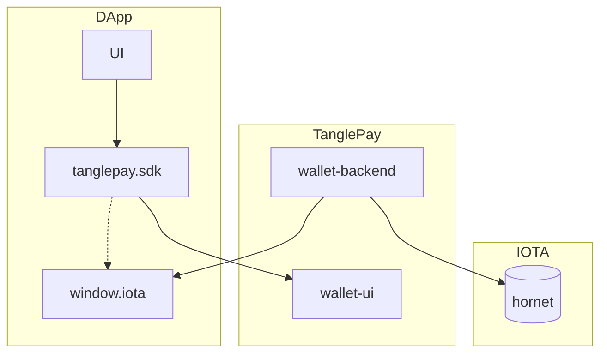

# TanglePay - Javascript/Typescript SDK

This repostiory contains Javascript/Typescript SDK for DApps in `IOTA` ecosystem to interact with TanglePay wallets.

You may find the following instructions familiar if you are already an experience DApp developer with Etherum, Metamask.
For more details, please refer to the specification below or the [Demo](https://tanglepay.github.io/TanglePay-SDK/).

## Architecture



## Supported Platforms

-   [x] Browser extensions
-   [x] Mobile

## Supported Networks

-   [x] IOTA
-   [x] Shimmer
-   [ ] Assembly
-   [x] EVM

## Getting started

Package Bundlers

`npm install tanglepay-sdk --save`

`yarn add tanglepay-sdk`

Standalone Browser Script

`<script lang="javascript" src="https://cdn.com/tangle-pay/package/dist/index.min.js"></script>`  

For any non-trivial IOTA web application — a.k.a. dapp, web3 site etc. — to work, you will have to:

-   Get reference to an IOTA SDK instance

```javascript
// esm module
import iota from 'tanglepay-sdk'
```

```javascript
// browser iife script
if (typeof window.iota !== 'undefined') {
    console.log('TanglePay is installed!')
}
```

-   Detect which IOTA network the user is connected to, which could be IOTA, Shimmer, Assembly
-   Get the user's IOTA account(s)

## API Reference

### Properties

#### _iota.isTanglePay_

`true` if the user has TanglePay installed.

#### _iota.redirectAppStoreIfNotInstalled_

`true` if the user does not have TanglePay installed, the app store will be opened.

#### _iota.tanglePayVersion_

`version` if the user has TanglePay installed.

### Methods

#### _iota.request(args)_

Use `request` to submit RPC requests to IOTA via TanglePay.

It returns a `Promise` that resolves to the result of the wallet method call.

The `params` and return value will vary by method.

In practice, if a method has any `params`, they are almost always of type `Object`.

If the request fails for any reason, the Promise will reject with an `ProviderError`.

Check the TanglePay Wallet API documentation for details.

##### Example

```javascript
params: {
    content: 'message to sign',
  },
;

iota
  .request({
    method: 'iota_sign',
    params,
  })
  .then((result) => {
    // The result varies by method.
    // For example, this method will return a message id on success.
  })
  .catch((error) => {
    // If the request fails, the Promise will reject with an error.
  });
```

### Events

#### _accountsChanged_

```javascript
iota.on('accountsChanged', handler: (accounts: Object) => void);
```

### Error

```javascript
interface ProviderError extends Error {
    message: string;
    code: number;
    data?: unknown;
}
```

### Wallet APIs

#### _iota_connect_

##### Returns

The address of current connected wallet.

##### Parameters

```javascript
params: {
    expires: 3000000 // expire time, default: 1 day (1000 * 3600 * 24 milliseconds).
}
```

The users will be redirected to the TanglePay and confirm connecting DApp with the current signed in wallet.

#### _iota_accounts_

##### Returns

string[] - An array of a logged in IOTA address string.

##### Description

Requests that the user provides an IOTA address to be identified by.

Returns a Promise that resolves to the hash of signed messaage.

If the user denies the request, the Promise will reject with an error.

You should only request the user's accounts in response to user action, such as a button click. You should always disable the button that caused the request to be dispatched, while the request is still pending.

### _iota_changeAccount_

##### Returns

address string

##### Parameters

```javascript
// iota
params: {
  network:'network',// mainnet, iota-evm, bsc, testnet
}
```

##### Description

If the user denies the request, the Promise will reject with an error.

You should only request the user's accounts in response to user action, such as a button click. You should always disable the button that caused the request to be dispatched, while the request is still pending.

#### _iota_getBalance_

##### Returns

Returns the balance of the account of given address.

Example

```javascript
{
  amount: "", // in # of IOTA
  collectibles: [
    {
        'source': 'soonaverse',
        'id': '',
        'media': '',
    }
  ],
  others: [
    {
        'symbol': 'asmb'
        'icon': '<uri of icon>',
        'amount': 312.312
    }
  ]
}
```

```javascript
{
  amount: "", // in # of Shimmer
  collectibles: [],
  others: []
}
```

##### Parameters

```javascript
// iota
params: {
  addressList:['<iota address>'] || [],
  assetsList:['iota'] // ['iota','soonaverse','smr','asmb']
}
```

```javascript
// shimmer
params: {
  addressList:['<shimmer address>'] || [],
  assetsList:['smr']
}
```

#### _eth_getBalance_

##### Returns

Returns the balance of the account of given address.

Example

```javascript
{
  amount: "", // in # of EVM
  collectibles: [
    {
        'source': 'soonaverse',
        'id': '',
        'media': '',
    }
  ],
  others: []
}
```

##### Parameters

```javascript
params: {
  addressList:['<evm address>'] || [],
  assetsList:['evm', 'soonaverse'] //
}
```

#### _iota_sign_

##### Returns

Signed hash data.

##### Parameters

```javascript
params: {
    content: '<data to sign>'
}
```

Wallet will use the private key to sign the payload directly and will **not** post the message to IOTA network.

##### Description

Requests that the user to sign the given message. Returns a Promise that resolves to an array of a single IOTA/Shimmer address string. If the user denies the request, the Promise will reject with an error.

The request causes a TanglePay popup to appear. You should only request the user's accounts in response to user action, such as a button click. You should always disable the button that caused the request to be dispatched, while the request is still pending.

If you can't retrieve the user's account(s), you should encourage the user to initiate an account request.

#### _personal_sign_

##### Returns

Signed hash data.

##### Parameters

```javascript
params: {
    content: '<data to sign>'
}
```

Wallet will use the private key to sign the payload directly and will **not** post the message to EVM network.

##### Description

Requests that the user to sign the given message. Returns a Promise that resolves to an array of a single EVM address string. If the user denies the request, the Promise will reject with an error.

The request causes a TanglePay popup to appear. You should only request the user's accounts in response to user action, such as a button click. You should always disable the button that caused the request to be dispatched, while the request is still pending.

If you can't retrieve the user's account(s), you should encourage the user to initiate an account request.

#### _iota_sendTransaction_

##### Returns

The id of the block created and the contructed block.

##### Parameters

```javascript
params: {
          to: 'address', // iota_address | shimmer_address
          value: 1, //amount
          unit:'', // default:iota->'Mi',['Mi','i']; shimmer->'SMR',['SMR','Glow']
          data: 'test'
}
```

Send a transfer from the balance on the seed.

##### Description

The request causes a TanglePay popup to appear. You should only request the user's accounts in response to user action, such as a button click. You should always disable the button that caused the request to be dispatched, while the request is still pending.

If you can't retrieve the user's account(s), you should encourage the user to initiate an account request.

#### _eth_sendTransaction_

##### Returns

```json
{
    "Data": {
        "TransactionId": "<transaciton id>"
    }
}
```

##### Parameters

```json
{
    "from": "<from>",
    "to": "<to>",
    "gas": "<gas>",
    "gasPrice": "<gasPrice>",
    "value": "<value>",
    "tags": [],
    "metadata": "<metadata>",
    "data": "<data>"
}
```

Create value transfer transactions given the following parameters.

-   `from`: (optional) if not specified, the wallet will select all available UTXOs from current wallet.
-   `to`: address of bech32 format.
-   `gas`: (optional) zero or optional for L1 networks.
-   `gasPrice`: (optional) zero or optional for L1 networks.
-   `value`: integer of the value to be transfered.
-   `tags`: (optional) additional tags to be sent with the transactions, only applicable for networks with Stardust upgrade.
-   `metadata`: (optional) additional metadata to be sent with the transactions, only applicable for networks with Stardust upgrade.
-   `data`: (optional): The compiled code of a contract.

##### Description

The request causes a TanglePay popup to appear. You should only request the user's accounts in response to user action, such as a button click. You should always disable the button that caused the request to be dispatched, while the request is still pending.

If you can't retrieve the user's account(s), you should encourage the user to initiate an account request.

#### _iota_getPublicKey_

##### Returns

IOTA Wallet PublicKey

##### Description

If you can't retrieve the user's account(s), you should encourage the user to initiate an account request.

## Best-Practice

### Create a sample DApp on IOTA

Please refer to the demo [here](https://tanglepay.github.io/TanglePay-SDK/).
